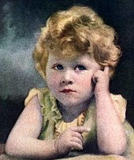

# Jornal

# Escola Gildo Veríssimo
# Aluna: Medlin Handara Silva Santos
# 8 A
---
                                                     
# **A Vida da Rainha Elizabeth II**
---
Nascimento: Nascida na área de Mayfair, em Londres, sendo a primeira filha do duque e da duquesa de Iorque, mais tarde rei Jorge VI e rainha Isabel. O seu pai subiu ao trono em 1936 após a abdicação do irmão, Eduardo VIII, tornando a princesa Isabel na herdeira presuntiva do trono britânico. Isabel foi educada particularmente em casa, começando a exercer funções públicas durante a Segunda Guerra Mundial, servindo no Serviço Territorial Auxiliar.  

Casamento: Em novembro de 1947, casou-se com Filipe Mountbatten, ex-príncipe da Grécia e da Dinamarca, em um casamento que durou 73 anos até a morte de Filipe em 2021. Tiveram quatro filhos: Carlos, Príncipe de Gales; Ana, Princesa Real; o príncipe André, Duque de Iorque; e o príncipe Eduardo, Conde de Wessex.

 

Morte do pai: O estresse da guerra acabou por afetar a saúde do rei,  exacerbado pelo pesado tabagismo e o subsequente desenvolvimento de um câncer de pulmão, entre outras doenças, incluindo a aterosclerose. Com o agravamento de seu estado de saúde a princesa Isabel, sua herdeira presuntiva, passou a assumir mais deveres reais. Uma viagem planejada à Austrália e Nova Zelândia foi adiada após o rei sofrer uma oclusão arterial na perna direita - que o obrigou a passar por uma cirurgia em março de 1949 sendo reorganizada com a princesa Isabel e seu marido, o duque de Edimburgo, viajando no lugar do rei e da rainha. Jorge estava bem o suficiente para abrir o Festival of Britain em maio de 1951, mas a 23 de setembro ele teve que ser submetido a uma pneumonectomia, devido ao tumor maligno em seu pulmão esquerdo.  Em novembro, na cerimônia de abertura do Parlamento, a fala do trono foi lida pelo lord chancellor Gavin Simonds.  Sua mensagem de Natal de 1951 foi gravada em seções, posteriormente editadas.

 

Em 31 de janeiro de 1952, apesar do conselho de pessoas próximas, o rei foi ao aeroporto de Londres para despedir-se da princesa Isabel, que partia em viagem à Austrália via Quênia. Na manhã de 6 de fevereiro, Jorge VI foi encontrado morto em sua cama na Sandringham House, em Norfolk. Ele morreu de uma trombose coronariana durante o sono, aos 56 anos de idade. Do Quênia, sua filha voltou imediatamente à Grã-Bretanha, como a rainha Isabel II.

Em 9 de fevereiro seu caixão foi depositado na Igreja de Santa Maria Madalena, em Sandringham, sendo transportado dois dias depois para o Westminster Hall. As cerimônias fúnebres tiveram lugar na Capela de São Jorge, no Castelo de Windsor, no dia 15. Seu corpo foi inicialmente sepultado sob a Abóbada Real até ser transferida para a "Capela Memorial Rei Jorge VI", no interior da Capela de São Jorge, em 26 de março de 1969. Em 2002, os restos mortais de sua viúva, a rainha Isabel, e as cinzas de sua filha mais nova, a princesa Margarida, mortas naquele ano, foram sepultados ao seu lado.

Morte da mãe: enquanto dormia no Chalé Real, Windsor, com sua filha, a rainha, ao seu lado. Ela estava sofrendo de um resfriado que já durava quatro meses. Isabel tinha 101 anos de idade, sendo, na época de sua morte, o membro da família real britânica com a maior longevidade da história. Esse recorde foi quebrado um ano depois por sua concunhada Alice, Duquesa de Gloucester, que morreu aos 102 anos em 29 de outubro de 2004. 

A rainha-mãe plantava camélias nos jardins de todas as suas residências, com um arranjo especial sendo colocado em cima de seu caixão quando ela foi levada de Windsor para seu velório no Salão de Westminster.  Mais de duzentas mil pessoas passaram para ver seu caixão no Palácio de Westminster. Membros de várias divisões das forças armadas ficaram de guarda nos quatro cantos de seu catafalco. Em certo momento, seus quatro netos, Carlos, Príncipe de Gales, André, Duque de Iorque, Eduardo, Conde de Wessex e David Armstrong-Jones, Visconde Linley, montaram guarda como um sinal de respeito conhecido como Vigília dos Príncipes – uma honra concedida apenas uma vez antes durante o velório do rei Jorge V.

 

No dia do seu funeral, a de 9 de abril, o governador geral do Canadá fez uma proclamação pedindo aos canadenses que honrassem a memória de Isabel naquele dia. Na Austrália, o governador-geral leu a lição num serviço memorial realizado na Catedral de Santo André, Sydney.

Em Londres, mais de um milhão de pessoas encheram a área fora da Abadia de Westminster e ao longo da rota de 23 milhas (37 km) do centro de Londres até o local de descanso final de Isabel ao lado do seu marido e da sua filha mais nova na Capela de São Jorge, Castelo de Windsor. A seu pedido, após o seu funeral, a coroa que estava sobre o seu caixão foi colocada na Tumba do Guerreiro Desconhecido, num gesto que ecoou o seu tributo no dia do seu casamento à 79 anos atrás.

Reinado:
